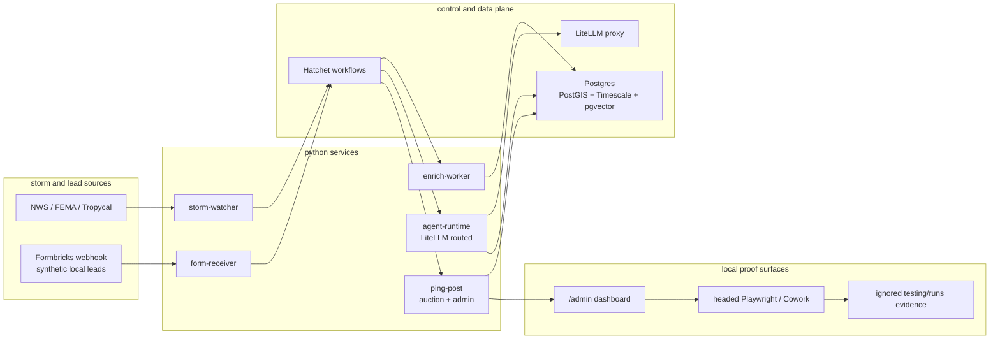
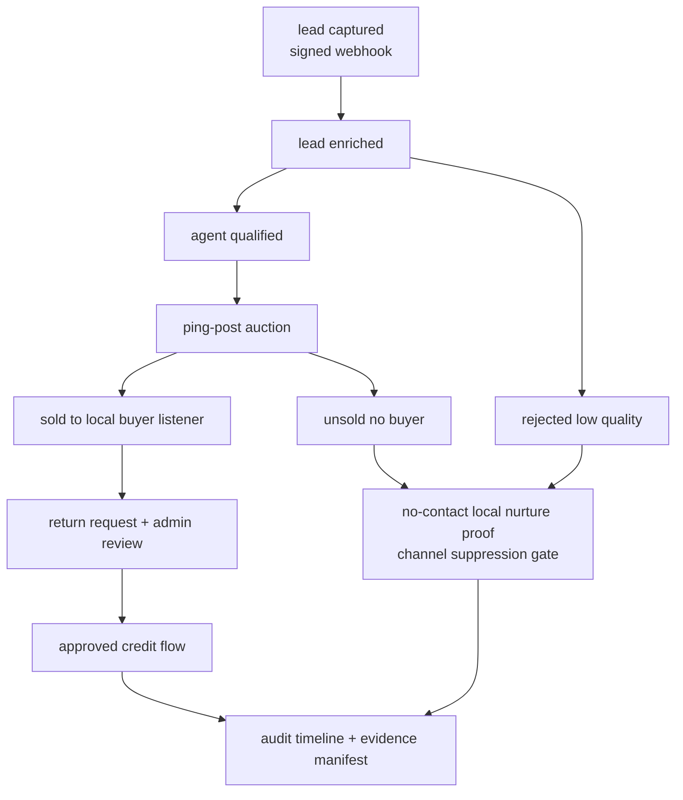
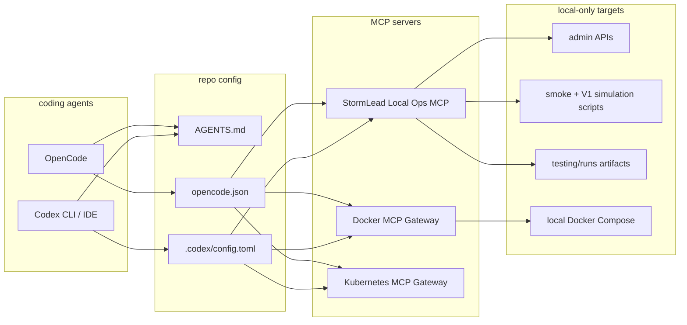

# stormlead

agentic storm-chase tree-removal lead-gen, fully self-hosted, python-first.

## what this is

a monorepo for a single-operator b2b lead-gen business: detect storm events, capture homeowner leads on pseo landing pages, qualify with agents, run a ping-post auction to a buyer roster of tree services, and dial unsold leads via voice ai.

dev runs on windows + wsl2 with docker compose. prod runs on hetzner + proxmox + lxc/vm. push via git, deploy with docker compose under systemd.

## the moat

the **ping-post engine** in `services/ping-post/`. nothing forkable exists for this on github — boberdoo/leadconduit/leadspedia are all closed saas. that's our wedge.

## layout

```
services/
  ping-post/                fastapi, the auction engine + cel filters
  storm-watcher/            tropycal/nws/fema pollers, hatchet cron
  enrich-worker/            deterministic lead enrichment + lead.enriched event
  agent-runtime/            LiteLLM-routed qualify/nurture/hermes workers
  form-receiver/            formbricks webhook ingestion + lead.captured event
  voice-bridge/             local-safe voice follow-up preview skeleton

libs/
  stormlead_core/           shared pydantic models, cel evaluator wrapper
  stormlead_db/             sqlalchemy + alembic migrations

apps/
  landing/                  local/demo landing page + synthetic lead submit gate
  buyer-portal/             buyer wallet, delivery report, and return review UI

infra/
  compose/dev/              docker-compose for wsl2 (optional voice profile)
  compose/prod/             (placeholder) docker-compose for hetzner
  caddy/                    caddyfile + coraza waf rules (re-add when apps land)
  litellm/                  config.yaml (pinned image, cosign-verified)
  openbao/                  (deferred) see infra/openbao/README.md
  sql/                      bootstrap sql (postgis, timescale, pgvector)

docs/
  research/                 stack audit + integration risk register (informed the choices)

skills/                     (placeholder) hermes-style agent skills
scripts/                    smoke, simulation, replay, browser evidence, and ops checks
.github/workflows/          (placeholder) ci/cd
```

provider-backed voice calls are not enabled yet; `services/voice-bridge` is a local-safe preview skeleton only.

## visual map

### system architecture



### lead lifecycle



### local agent and tool routing



## quickstart (windows local)

Prerequisites: Docker Desktop running, Node.js/npm, Python 3.12+, and `uv` on PATH.

```powershell
npm run setup:local
npm run verify:local
```

`setup:local` installs Node and Python dependencies, creates `.env` from `.env.example` if needed, starts the local Docker Compose pipeline stack, runs database initialization/migrations, seeds synthetic demo data, and runs the local readiness doctor.

After setup:

```text
Admin:        http://127.0.0.1:8003/admin
Landing:      http://127.0.0.1:8005
Buyer Portal: http://127.0.0.1:8004
Voice Bridge: http://127.0.0.1:8006/readyz (with Docker Compose profile `voice`)
```

Useful local commands:

```powershell
npm run start:local      # start the local pipeline stack again
npm run verify:local     # readiness doctor + synthetic smoke
npm run validate:ingress # check Caddy reverse proxies exist in dev Compose
npm run simulate:v1      # broader synthetic V1 scenario simulation
npm run doctor           # readiness status and next safe command
npm run reset:demo       # re-seed fixed local demo buyers/leads
```

To run the local-safe voice follow-up preview without phone-provider contact:

```powershell
docker compose -f infra/compose/dev/docker-compose.yml --profile voice up voice-bridge
```

## quickstart (wsl2 / just optional)

```bash
cp .env.example .env
just up-pipeline
just migrate
just seed
just smoke
```

## production (hetzner)

prod compose + deploy script are placeholders (`infra/compose/prod/`, `.github/workflows/`). add them when the first non-dev environment exists.

## documentation map

- `docs/research/README.md` — current business and product operating model. start with `implementation guide`, `self-hosted framework review`, and `40 percent irr operating model`.
- `docs/research/2026-05-architectural-fit.md` — architecture decisions and why v1 uses postgres, hatchet, fastapi, and hetzner us regions.
- `docs/research/visual-agentic-workflow-runbook.md` — admin workflow timeline, review actions, KPI semantics, and Cowork evidence manifests.
- `docs/research/v1-paid-pilot-runbook.md` — local technical V1 controls, scoped readiness, and evidence commands.
- `testing/README.md` — visible Playwright/Cowork evidence rules, the MCP/Puppeteer self-learning loop, artifact hygiene, and official browser automation references.
- `docs/research/ui-tars-agent-tars-runbook.md` — optional local UI-TARS/Agent TARS coworker workflow for human-like visual and UX exploration.
- `docs/research/tree-damage-mvp-compliance-plan.md` — MVP ad, consent, safety-gate, and buyer-delivery rules for tree-damage lead resale.
- `docs/research/2026-05-stack-improvements.md` — active technical risk register and implementation corrections.
- `tools/TOOLS.md` — local-first tool routing, MCP safety rules, and validation commands.
- `tools/mcp/README.md` — custom StormLead Local Ops MCP tools and safety model.
- `.codex/README.md` — Codex CLI scripts and project-scoped MCP setup using the repo's Docker MCP profiles.
- `AGENTS.md` — repo-local operating guide for coding agents.
- `docs/research/2026-05-forkable-stack.md` and `docs/research/2026-05-stack-audit.md` — preserved source research; use the newer docs when they conflict.

## known traps (read these)

1. **litellm**: pinned to a known-good image sha after the march 2026 supply-chain attack. do not `pip install litellm` anywhere. only the cosign-verified docker image. Runtime model calls use the LiteLLM OpenAI-compatible proxy only.
2. **direct provider sdks**: not allowed in runtime services. `agent-runtime` calls `${LITELLM_PROXY_URL}/v1/chat/completions`; static tests reject direct Anthropic/OpenAI SDK imports.
3. **postgres mcp**: anthropic's reference server is archived + exploitable. we use `crystaldba/postgres-mcp-pro` behind a read-only role. (pin a specific tag, not `:latest`.)
4. **suna**: not used. agent execution is a small LiteLLM HTTP client, no supabase.
5. **rust**: not used. python everywhere. rewrite ping-post hot path in go later if we cross 500 leads/sec sustained.
6. **hetzner region**: deploy to ashburn (us-east) or hillsboro (us-west). a falkenstein/helsinki box adds 150–200ms rtt to every buyer ping/post — eats the auction's <5s budget. see `docs/research/2026-05-architectural-fit.md`.
7. **nats / seaweedfs / openbao not in v1 compose**: cut after architectural-fit research. hatchet handles durable workflows on postgres; hetzner object storage replaces seaweedfs in prod; sops-encrypted `.env.prod` replaces openbao until 2nd operator. re-add any of these when a concrete need surfaces, not before.
8. **self-hosted business framework**: current operating model and 40% irr guardrails live in `docs/research/README.md` under `self-hosted framework review` and `40 percent irr operating model`. treat these as the business design constraints for future implementation.
